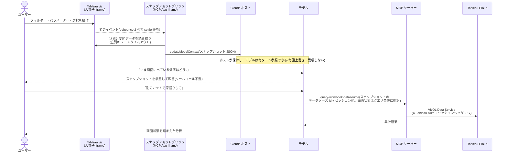

# Tableau MCP — EAS auth mode fork

> **これは [tableau/tableau-mcp](https://github.com/tableau/tableau-mcp) の実験的フォークです。**
> 本家プロダクトの README・ドキュメント・Issue・サポートは upstream と
> [公式ドキュメント](https://tableau.github.io/tableau-mcp/) を参照してください。
> This is an experimental fork of tableau/tableau-mcp adding an `AUTH=eas` mode. For the official
> product, please refer to the upstream repository.

このフォークが upstream に足すものは 3 つ:

1. **[EAS 認証モード](#eas-認証モード)**(本体) — `AUTH=eas` を追加し、per-user の
   埋め込み viz を一般の Tableau Cloud サイトで成立させる
2. **[Viz 状態スナップショット](#viz-状態スナップショット)** — 埋め込み viz の画面状態を
   モデルコンテキストへ push し、裏のデータソースへの深掘りクエリまでつなぐ
3. **[Pulse メトリックの埋め込み](#pulse-メトリックの埋め込み)** — `<tableau-pulse>` の
   iframe 描画と状態 push

---

## EAS 認証モード

認証モード **`AUTH=eas`(Connected App / OAuth 2.0 Trust = 外部認可サーバー)** を追加する。
MCP サーバー自身を Tableau サイトに EAS として登録し、サーバーが保持する RS256 鍵で
REST サインイン用 JWT と埋め込み用 JWT の両方を署名する。ゴールは、ユーザー体験を
「OAuth リダイレクトで Tableau にログインし、サイトを選ぶだけ」に保ったまま、MCP Apps の
per-user 埋め込み viz を成立させること。設定方法と環境変数は
[docs/.../authentication/eas.md](docs/docs/configuration/mcp-config/authentication/eas.md) を参照。

### 背景 — なぜ EAS モードが必要か

tableau-mcp の MCP Apps 機能は、チャット UI 内の iframe に Tableau viz を埋め込み表示できる
(`render-interactive-viz` / `get-embed-token`)。この埋め込みには Embedding API v3 用の JWT が
必要になる。upstream 4.0.6 時点で、サーバーがその署名に使える材料は次の2つしかない:

- **direct-trust**(Connected App / Direct Trust): サイト単位の共有 secret(HS256)。動作するが、
  site-wide の secret をサーバーに置く運用になる
- **uat**([Unified Access Token](https://help.tableau.com/current/api/cloud-manager/en-us/docs/unified_access_tokens.html)):
  Tableau Cloud Manager 経由で組織管理者が構成する仕組み(2025年12月導入)。Cloud Manager への
  アクセス権が前提で、サイト管理者の権限だけでは完結しない

per-user かつ一般の Tableau Cloud サイトで使える署名方式が存在しない。これが EAS を第3の方式として
実装した理由である。EAS はサーバー内部への「署名器」の追加であり、既存の OAuth ログイン層
(`src/server/oauth/`)には一切手を入れていない。

### Tableau Cloud で実測して確定した仕様

公式ドキュメントに無い・矛盾している挙動。2026年8月時点、Tableau Cloud サンドボックスでの実測:

1. **`aud` クレームは `tableau:<site_luid>` が正**。ヘルプの一部に残る素の `"tableau"` は
   エラー 10084 で拒否される(旧仕様)。site LUID は Connected App 登録後の「Copy Site ID」で
   取得できる
2. **Tableau は EAS の JWKS 発見時、issuer の `/.well-known/openid-configuration` と
   `/.well-known/oauth-authorization-server` をノードによって使い分ける**。片方だけ serve すると
   サインインが確率的に失敗する(実測で成功率 ~1/6 まで低下)。両パスに同一メタデータを
   serve することで安定する
3. `jti` は**単回使用**として強制される(エラー 10091)。トークンごとに UUID を生成する必要がある
4. UI 登録(Name / Issuer URL / Enable のみ)だけで JWKS 発見は機能する。`jwksUri` の明示指定は
   REST API(Register EAS)でのみ可能だが、必須ではなかった
5. REST サインインも Embedding API v3 も EAS 署名 JWT を受理する(embed は scp
   `["tableau:views:embed"]`)

### デプロイ構成の注意(Tableau Cloud)

- **issuer は Tableau Cloud から到達可能な公開 HTTPS URL であること**。Tableau 側がメタデータと
  JWKS を能動的に fetch しに来るため localhost 不可。ローカル検証には HTTPS トンネルか
  リモートデプロイが必要
- **埋め込み認可サーバーモード(`OAUTH_EMBEDDED_AUTHZ_SERVER=true`)は Cloud のリモートデプロイでは
  使えない**。Tableau Cloud の OAuth エンドポイント(client_type=tableau-mcp)は、認可コードの
  返し先(redirect_uri)を `http://127.0.0.1:<port>` の loopback に限定している(公開 HTTPS は
  400)。この許可リストを広げる設定は Tableau Server の TSM にしか存在しない。Cloud では
  `OAUTH_ISSUER=https://sso.online.tableau.com` + `OAUTH_EMBEDDED_AUTHZ_SERVER=false` を使う
- **sso.online.tableau.com は動的クライアント登録(DCR)非対応・CIMD のみ対応**。DCR 前提の
  mcp-remote(0.1.38 時点)では接続できない。CIMD 対応の MCP クライアント
  (claude.ai のカスタムコネクタ等)を使う
- サーバーの配置リージョンは Tableau ポッドの近傍を推奨(JWKS fetch のレイテンシ対策)

### 既知の制約 — ホスト側 CSP(サーバー外、2026年8月時点)

Claude Desktop / claude.ai では、MCP Apps 内の viz 表示だけが
「Authentication was unsuccessful」で失敗する。これはサーバー側の問題ではない。
スタンドアロンの Embedding API v3 ページでは同じ JWT で viz が描画されることを確認済み。

原因は Claude 側の MCP Apps サンドボックスが UI リソースの `csp.frameDomains` 宣言を無視して
`frame-src 'self'` を強制し、Tableau viz のネスト iframe をブロックすること
([anthropics/claude-ai-mcp#40](https://github.com/anthropics/claude-ai-mcp/issues/40))。
frameDomains を尊重するホストでは動作する見込み。

---

## Viz 状態スナップショット

埋め込み viz をユーザーが操作すると、iframe 側が**現在のフィルター・パラメーター・選択マーク・
アクティブシートの要約データ(件数上限つき)**をスナップショットにまとめ、ext-apps の
`updateModelContext` でウィジェットのモデルコンテキストへ push する。これによりモデルは
「いま画面に出ている数字」を推測や再クエリなしで答えられる。スナップショットに無いカット・
別シート・打ち切られた行の先は、スナップショットが運ぶデータソース参照と VizQL セッション値を
そのまま `query-workbook-datasource` に渡して引き直す(下記)。published データソースの
LUID が別途分かっている場合は従来どおり `query-datasource` も使える。

`render-interactive-viz` のツール結果は `content[0]` に従来どおりの生 JSON、`content[1]` に
この使い分けを説明するガイダンステキストを返す。`content[0]` は iframe が `JSON.parse` するため
バイト単位で変更してはいけない。

### 動作の全体像

「状態の把握」と「データの取得」を分離しているのが要点。前者は push 済みのスナップショットで
即答でき(ツールコール不要)、後者だけがツールコールになる。どちらの経路にも Tableau への
書き込み・MCP サーバー側の状態保持は無い。

### ウィジェット恒久破損(brick)という失敗モード

**これは運用上もっとも重要な注意点である。** Claude ホストはウィジェットのモデルコンテキストに
**約 16,000 トークンの上限**を課す。この値は公開仕様ではなく実装依存であり、しかも判定は
**push 時ではなく表示(display)時**に行われる。

結果として次の順序で不可逆な破損が起きる:

1. 上限超過のペイロードでも push 自体は成功し、ホスト側に**保存される**
2. 次の表示時に上限判定が走り、ウィジェットが**レンダリングを恒久的に拒否**する
3. レンダリングされない = iframe が動かない = **保存値を上書きできる唯一の手段が失われる**
4. そのツールキーは以後永久に死ぬ

**復旧手段はツール名(= ウィジェットキー)のリネームのみ。** リネームが必要な箇所:

- `src/tools/web/renderInteractiveViz/renderInteractiveViz.ts` — `name:` フィールドと
  `getAppConfig(...)` の引数(`resourceUri` は `ui://<tool-name>/mcp-app.html` として
  ツール名から生成されるため、ここを直せば追従する)
- `src/tools/web/toolName.ts` — `webToolNames` 配列(42行目付近)と `webToolGroups` の
  `mcp-apps` グループ(103行目付近)の両方
- `src/server/oauth/scopes.ts` — `toolScopeMap` のキー(329行目付近)と、mcp-apps 無効時に
  `enabledTools.delete('render-interactive-viz')` する箇所(399行目付近)

### 防御 — クライアント側ハードキャップ

上限判定が push 時に行われない以上、**送る前に自分で止めるしかない**。iframe 側は
`src/web/apps/src/embed/vizState/payload.ts` の `PUSH_BUDGET_BYTES = 30,000` バイトを
ハードキャップとして持つ。

- 保守的に 2.5 文字/トークンで見積もって約 12k トークン。16k に対して約 25% のマージン
- 予算を超えるペイロードは**送信しない**。データ行を削って収まる形にしてから push する
- 16,000 という値が実装依存である以上、キャップは**変更可能な定数**として置いてある

### データソースへの深掘り(query-workbook-datasource)

スナップショットには、**表示中のシート/ダッシュボード配下の全ワークシートのデータソース参照**
(`datasources[]`: 内部 id・名前・`isPublished`・使用シートの `worksheets` ラベル。id で重複排除、
全体 8 件上限)と、viz の **VizQL セッション値**(`vds`)が載る。`query-workbook-datasource` は
この 2 つを引数に取り、サーバー側が自前の認証トークン + セッションヘッダで VizQL Data Service を
呼ぶ。クエリの書式は `query-datasource` と同一。`query` を省略するとフィールド一覧を返す。

要点:

- **LUID 不要**。Embedding API の `DataSource.id`(`sqlproxy.*` / `federated.*`)をそのまま使う。
  名前解決・Metadata API 往復が要らない
- **埋め込みデータソース(published でない = LUID が存在しない)にも到達できる**。
  これはこの経路の固有価値で、`query-datasource` では原理的に不可能
- セッションは viz 単位で、**ダッシュボード配下のどのシートのデータソースにも同じ値で効く**
  (実測済み)。ページを閉じても即座には失効しない(26 分後の生存を実測。上限は未測定)
- **クエリ結果は画面のフィルター状態を反映しない**。スナップショットの `filters` /
  `parameters` をクエリ条件へ翻訳するのはモデルの責務(push 文言で明示している)
- サーバー側でセッション ID はログ・通知からマスクされる。データソース許可リスト
  (`INCLUDE_DATASOURCE_IDS` 等)は LUID 前提のためこのツールには適用されない
  (該当運用ではツール自体を無効化する)

設計判断と実測の根拠は [worklog](worklog/20260804-query-workbook-datasource.md) と
[verification/vds-embedding-id/FINDINGS.md](verification/vds-embedding-id/FINDINGS.md) を参照。

### 想定しているダッシュボード像

本機能がどんなダッシュボードを想定して設計されているか(フィルター/パラメーターでの
状態表現、公開データソースの参照、計算フィールドの置き場所)と、その根拠となる
Embedding API / VDS の制約は [AI-DASHBOARD-NOTES.md](AI-DASHBOARD-NOTES.md) に
制約メモとしてまとめてある。

### 検証記録

実 viz に対する手動受け入れ(capture→push 経路の実機検証)の結果と、そこで確定した
事実は [verification/viz-state/ACCEPTANCE.md](verification/viz-state/ACCEPTANCE.md) に
記録してある。

---

## Pulse メトリックの埋め込み

`render-pulse-metric` は Tableau Pulse メトリックを `<tableau-pulse>` として iframe に描画する。
viz 側(`render-interactive-viz` + `embed-viz` バンドル)と対称の構成で、専用の単一ファイル HTML
バンドル `embed-pulse`(`mcp-pulse.html`)を持つ。フィルター・期間・提示されたインサイトは
viz と同じく `updateModelContext` でモデルコンテキストへ push する。

**スナップショットに数値は入らない。** `<tableau-pulse>` には要約データを読む API が無く、
メトリック値は Pulse のインサイト API の担当だからである。数値が要るときは
`generate-pulse-metric-value-insight-bundle` か `query-datasource` を使う旨を、push する
プリアンブルとツール結果のガイダンス文の両方に明記してある。

### 埋め込みトークンのスコープ

**Pulse 埋め込みは `tableau:insights:embed` と `tableau:views:embed` の両方を要求する。**
公式ドキュメントに後者が必要である旨の記載はない。`insights:embed` 単独だと embed signin は
200 で通るのに後続 API が 401 になり、ユーザーにはセッション切れとして見える
(実測値と切り分け手順は [verification/pulse-embed/FINDINGS.md](verification/pulse-embed/FINDINGS.md))。

このため `get-embed-token` は任意パラメータ `target`(`viz` / `pulse`)を取る。省略時は従来どおり
`views:embed` 単独で署名するため、viz 経路の挙動は変わらない。

---

## Tableau Server への読み替え

Server では EAS 登録が TSM(サーバー単位)になる、JWKS の公開露出が不要になる、
埋め込み認可サーバーモードが TSM 設定でリモートでも成立する、など複数の点が変わる。
[TABLEAU-SERVER-EAS.md](TABLEAU-SERVER-EAS.md) に整理してある(未実測)。

## License

Upstream に従い [Apache-2.0](LICENSE.txt)。
