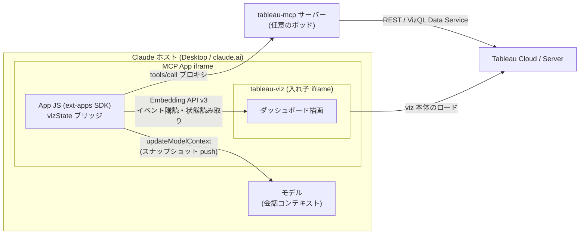

# viz 状態スナップショット機能の実装と検証

日付: 20260802
対象コミット: 実装 96d25b08 / 検証記録 6114b903
関連文書: README「Viz 状態スナップショット」節、[AI-DASHBOARD-NOTES.md](../AI-DASHBOARD-NOTES.md)、
[verification/viz-state/ACCEPTANCE.md](../verification/viz-state/ACCEPTANCE.md)

## 背景

MCP Apps の `render-interactive-viz` はチャット UI 内 iframe に Tableau viz を描画するが、
ユーザーが viz を操作(フィルター・パラメータ・選択)しても AI はそれを知る術がなかった。
「会話で画面に言及したら AI が現在の表示状態と表示データを踏まえて応答できる」を実現する。

前提制約: リモート MCP サーバーは複数ポッド・ラウンドロビンでステートレス運用。
Tableau への書き込みは避けたい(ユーザー要求)。

## 全体アーキテクチャ

登場する実行コンテキストは 4 つ。鍵は「MCP App iframe の JavaScript」が Tableau viz と
Claude ホストの両方に対する API を持つ唯一の場所だという点で、状態スナップショットの
ブリッジはここに置くしかない。

動作シーケンス(採用形)は README「Viz 状態スナップショット > 動作の全体像」の図を参照。

## 変更内容

- iframe 側 `src/web/apps/src/embed/vizState/`(新規 10 モジュール):
  viz 操作の settle 後(debounce 2 秒)に、状態 JSON + アクティブシートの要約データを
  ext-apps `updateModelContext` で push する。直列キュー(呼び出し毎 5 秒 / 全体 15 秒 /
  fail-fast)、whitelist シリアライザ、30KB ハード予算と削減ラダー、circuit breaker
  (連続タイムアウト 2 回で縮退 push 後に自己 dispose)
- 既存変更は `handleToolResult.ts`(payload 拡張 parse + bridge 起動/再配送時 dispose)と
  `embedTableauViz.ts`(生成要素を返す)のみ
- サーバー側は `renderInteractiveViz.ts` に `getSuccessResult` フックで content[1] に
  英語の誘導文を追加(content[0] は iframe が JSON.parse するためバイト同一を維持)
- ドキュメント: README に恒久閉塞 failure mode と復旧手順、AI-DASHBOARD-NOTES.md(制約メモ)

## 設計判断

### 採用: 状態プッシュ + VDS 深掘り方式(検討時の呼称: F+ 案)

App が push するのは「状態 + 予算内データ」のみで、深掘りは既存 `query-datasource`
(VizQL Data Service = VDS)。サーバーを完全ステートレスに保て、使う機構がすべて実測で
動作確認済みのものだけで構成される。

### 検討した全方式と判定

設計調査では 7 方式を比較した。検討時はアルファベットの略称で呼んでいたため、
コミットメッセージや検証記録に現れる呼称を括弧で併記する。

| 方式(検討時呼称) | 仕組み | 判定 | 決め手 |
|---|---|---|---|
| 全量自動 push(A) | 操作のたびに状態+表示データ全量を送信 | 却下 | コンテキスト汚染。操作イベントの網羅も不能 |
| 共有ボタン(B) | ユーザーが明示操作でスナップショットを会話に注入 | v1 対象外 | 「言及するだけで通じる」体験と不一致 |
| REST フィルター変換(C1) | push された状態を REST の `vf_` パラメータに変換して再取得 | 部分吸収 | 範囲・相対日付フィルターが `vf_` で表現不能と実測。VDS クエリへの写像に発展して採用案の一部に |
| カスタムビュー保存(C2) | 状態を Tableau にカスタムビューとして保存し REST で読む | v2 に格下げ | 全部品の動作は実測済みだが、Tableau への書き込み回避というユーザー要求に反する。「この状態を覚えて」の明示操作専用に温存 |
| App 登録ツール(D) | iframe がモデルから呼べるツールを登録し、必要時に画面状態を直接読ませる Pull 型 | 現状不成立 | SDK レベルでは動作(1〜2ms)するが、Claude ホストが App-Provided Tools 非対応と実測。draft 仕様限定でもある |
| long-poll リレー(E) | サーバー定義ツールが iframe とランデブーして応答を中継 | 見送り | 複数ポッドでは共有ストア(Redis 等)が必須になり、ステートレス前提と衝突 |
| 状態プッシュ + VDS(F+) | 軽量な状態 JSON を毎回上書き push し、深掘りだけツールコール | **採用** | 実測済みの部品のみで構成でき、サーバー状態ゼロ・Tableau への書き込みゼロ |

### 不採用案の温存条件

- **App 登録ツール(D)**: ホストが App-Provided Tools を実装したら復活。probe アプリの
  再実行だけで判定でき、iframe 側の読み取り実装は共通なので移行コストは配線のみ
- **long-poll リレー(E)**: MCP の MRTR(`input_required`)が MCP Apps 向けルーティングを
  定義したら、「サーバーがクライアント側情報を追加要求する」公認パターンとして置き換え可能
- **push を structuredContent で送る案**: ホストが再シリアライズするためバイト数が
  制御不能になり、30KB 予算(下記)の意味が消える。text block 一本に固定(これは方式では
  なく実装レベルの判断)

### 予算防御が最重要である理由

ホストはウィジェットのモデルコンテキストに約 16,000 トークンの上限を課す(非公開実装値・
**表示時**評価)。超過 push はエラーにならず受理された後、ウィジェット描画が恒久拒否になり、
上書き手段(= パネル内の App)ごと失われて同一ツールキーが死ぬ。実測でこのデッドロックを
踏んだ。防御はアプリ側にしか置けないため、シリアライザは予算超過の出力を構造的に返せない
設計にし(削減ラダー + 最終不変条件)、復旧手順(ツールキー変更)を README に明記した。

### その他の判断

- **初回 push あり**: `firstinteractive` を操作イベントと同じ debouncer に通す。
  「何が見えてる?」という初手の質問に答えられ、以後の push が上書きするためコストなし
- **`summarydatachanged` をバックストップ購読**: `parameterchanged` / `tabswitched` の
  発火が設計時点で未実測だったため。受け入れ検証で `parameterchanged` の発火は確認できたが、
  逆に `summarydatachanged` はアクティブシートに影響しない変更では発火しないことも
  分かり、直接購読とバックストップの両輪が正解だった
- **payload に `errors?: string[]` を追加**(当初仕様のスキーマ外): story 未対応・
  API バージョン不足・シート読取不可・タイムアウト中断を AI に伝える運搬路が必要だった
- **「ガイドライン」から「制約メモ」への転換**: ダッシュボード設計文書は当初
  ガイドラインとして書いたが、実運用ゼロの段階で処方を名乗るのは証拠レベルと不一致という
  判断で、「実測制約からの導出メモ」(AI-DASHBOARD-NOTES.md)に枠組みを反転した

## 検証

- 自動: 新規 128 テストを含め 2813 green(既存 1 失敗は Windows パス起因で、クリーン
  HEAD でも失敗することを確認済み)。lint はソースツリー clean。3 変種ビルド green
- 手動受け入れ: 実 viz に対する capture→push 経路の実機検証 3 項目すべて合格。
  結果と実機で確定した事実は [verification/viz-state/ACCEPTANCE.md](../verification/viz-state/ACCEPTANCE.md)

## 残課題

- **full E2E が未実施**: Claude ホストが MCP Apps の `csp.frameDomains` を無視するため
  (anthropics/claude-ai-mcp Issue #40)、ホスト内で Tableau viz iframe 自体が描画されない。
  修正後に「会話で言及 → モデルがスナップショット参照」の往復を確認する
- Claude web では `updateModelContext` 不達の報告あり(同 Issue #102)。実装側は
  telemetry(record-event)で観測可能にしてある
- story シートは明示的に未対応(payload の errors で通知)
- `objectType === 'view'` のとき workbook luid は取得不能(render payload に無く
  Embedding API にも無い)。サーバー側で content[0] に `workbookLuid` を足す追加変更で
  解消可能(additive、iframe の parse を壊さない)
